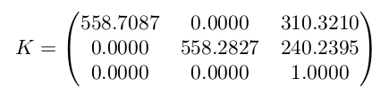

# Two view sparse reconstruction

### Description

The following code reconstruct the scene being captured from a calibrated monocular camera.

The images are located in the images folder and the calibration matrix is given below:

Results are present in Report.pdf